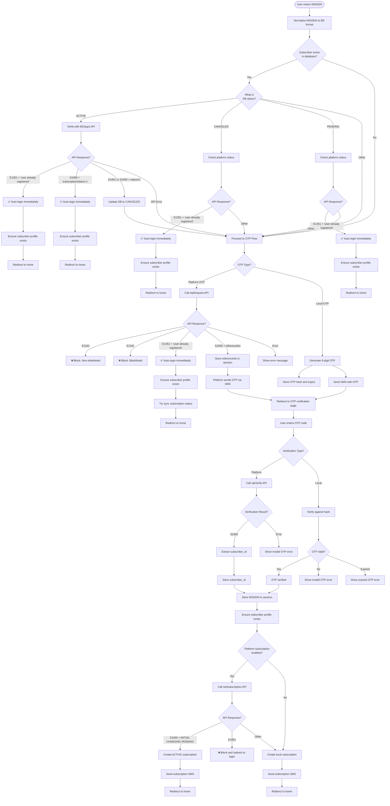
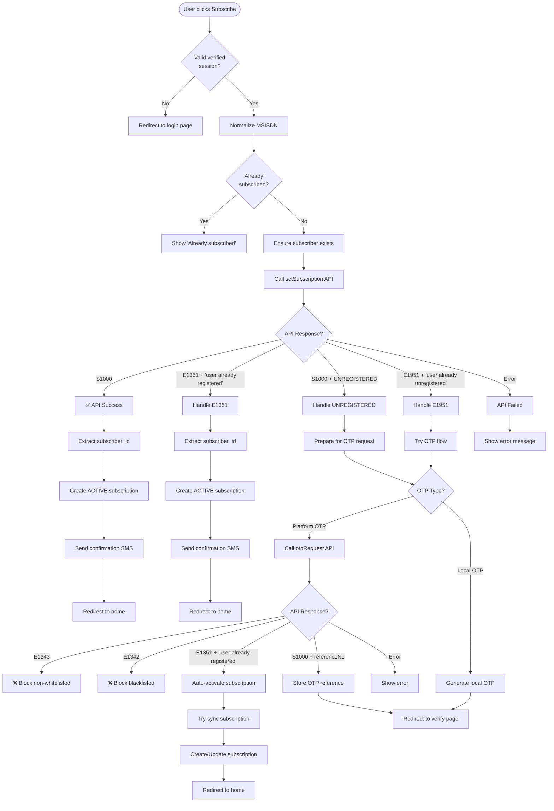
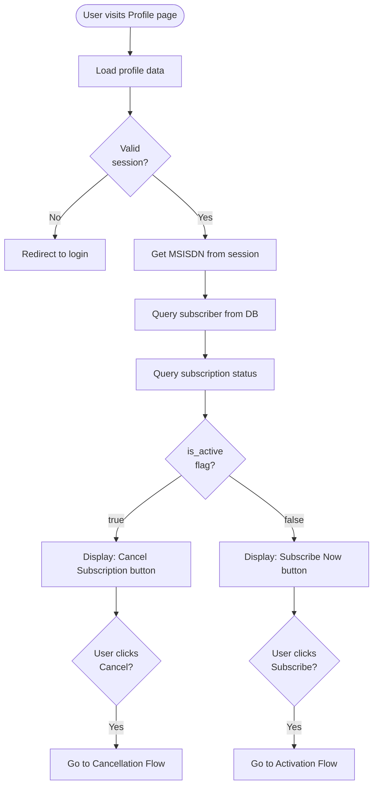

# Login and Subscription Flow Chart

## Overview
This document describes the conditional login and subscription flows in the AppsBanglaWeb application, including OTP verification, platform API integration, and subscription management.

## Key Status Codes

### BDApps API Status Codes
- **S1000**: Success - Request processed successfully
- **E1351**: User already registered on platform
- **E1951**: User already unregistered or invalid format
- **E1342**: Blacklisted number
- **E1343**: Non-whitelisted number

### Subscription Status
- **Active (`STATUS_ACTIVE`)**: User has active subscription
- **Canceled (`STATUS_CANCELED`)**: User unsubscribed
- **Pending (`STATUS_PENDING`)**: Subscription pending activation
- **INITIAL CHARGING PENDING**: Platform charging in progress

---

## 1. Login Flow



---

## 2. Subscription Activation Flow



---

## 3. Subscription Cancellation Flow

```mermaid
flowchart TD
    Start([User clicks Unsubscribe]) --> CheckSession{Valid verified<br/>session?}
    
    CheckSession -->|No| RedirectLogin[Redirect to login page]
    CheckSession -->|Yes| NormalizeMSISDN[Normalize MSISDN]
    
    NormalizeMSISDN --> HasActive{Has active<br/>subscription?}
    
    HasActive -->|No| ShowNotActive[Show 'No active subscription']
    HasActive -->|Yes| EnsureExists[Ensure subscriber exists]
    
    EnsureExists --> CheckSubId{Has<br/>subscriber_id?}
    
    CheckSubId -->|No + Platform enabled| ShowManualInstr1[Show manual SMS instructions]
    CheckSubId -->|Yes or Platform disabled| CallUnsubAPI[Call setSubscription(false)]
    
    CallUnsubAPI --> UnsubResponse{API Response?}
    
    UnsubResponse -->|S1000| UnsubSuccess[✅ Unsubscribe success]
    UnsubResponse -->|E1951 + 'already unregistered'| TreatAsSuccess[Treat as success]
    UnsubResponse -->|Error| UnsubFailed[Unsubscribe failed]
    
    UnsubSuccess --> CreateCanceledSub1[Update to CANCELED status]
    TreatAsSuccess --> CreateCanceledSub2[Update to CANCELED status]
    
    CreateCanceledSub1 --> SendUnsubSMS1[Send confirmation SMS]
    CreateCanceledSub2 --> SendUnsubSMS2[Send confirmation SMS]
    
    SendUnsubSMS1 --> RedirectHome1[Redirect to home]
    SendUnsubSMS2 --> RedirectHome2[Redirect to home]
    
    UnsubFailed --> ShowManualInstr2[Show manual SMS instructions<br/>with error details]
```

---

## 4. Profile Page Subscription Management



---

## 5. Conditional Logic Summary

### Auto-Login Conditions (Skip OTP)
The system automatically logs in users without OTP verification when:

1. **E1351 + "user already registered"**: Exact match (case-insensitive)
   - User is registered on BDApps platform
   - Triggers immediate login with session creation

2. **S1000 + subscriptionStatus = "1"**: Active subscription confirmed
   - User has active subscription on platform
   - Triggers immediate login with auto-subscribe

### OTP Required Conditions
OTP verification is required when:

1. New user (not in database)
2. Canceled subscription status in DB
3. Pending subscription status in DB
4. API check fails or returns non-success
5. Any status code other than E1351 or S1000+active

### Blocked Login Conditions
Login is completely blocked for:

1. **E1342**: Blacklisted number
2. **E1343**: Non-whitelisted number
3. **E1951**: Invalid format or already unregistered (during platform subscription)

### Subscription Auto-Activation
Subscription is automatically activated for:

1. **E1351 + "user already registered"**: User already on platform
2. **S1000 + INITIAL CHARGING PENDING**: Platform charging initiated
3. Successful OTP verification → auto-subscribe on login

---

## 6. Special Cases

### UNREGISTERED Status Handling
When `setSubscription` returns **S1000 + UNREGISTERED** or **E1951**:
1. Treat as conditional success
2. Initiate OTP request to obtain subscriber_id
3. Check platform status via OTP flow
4. If E1351 detected → auto-activate subscription
5. Otherwise → complete OTP verification flow

### Manual SMS Instructions
Shown when:
1. User has no `bdapps_subscriber_id` and platform subscription is enabled
2. API unsubscribe fails
3. Instruction format: `"STOP {sourceAddress} to 21213"`

### Session Management
- Valid session requires: `msisdn` in session + `is_guest = false`
- Guest mode: `is_guest = true` (limited access)
- Logout: Clears `msisdn` and `is_guest` from session

---

## 7. Data Flow

### Subscriber Sync Process
1. **Ensure subscriber exists**: Create profile if missing
2. **Extract subscriber_id**: From API responses (otpVerify, setSubscription, getSubscriptionStatus)
3. **Update subscriber_id**: Store in `subscribers.bdapps_subscriber_id`
4. **Sync subscription**: Keep DB in sync with platform status

### Subscription Status Tracking
Database tracks:
- `status`: ACTIVE, CANCELED, PENDING
- `starts_at`: Activation timestamp
- `ends_at`: Cancellation timestamp
- `channel`: Source of subscription (web, platform, etc.)
- `last_message`: Latest status message

### Platform API Integration
BDApps API calls:
- `otpRequest`: Initiate OTP flow
- `otpVerify`: Verify OTP code
- `setSubscription`: Activate/cancel subscription
- `getSubscriptionStatus`: Check current status

---

## 8. Error Handling

### API Errors
- Non-blocking: Log warning, allow fallback
- Blocking: E1342, E1343, E1951 (during login)
- Fallback: Use local subscription if platform fails

### OTP Errors
- Invalid OTP → retry with error message
- Expired OTP → redirect to request new OTP
- Missing session → redirect to login

### Session Errors
- No MSISDN → redirect to login
- Guest mode → redirect to login for protected actions

---

## Configuration

### Environment Variables
```php
// OTP Configuration
'services.bdapps.use_platform_otp' => true|false

// Subscription Configuration
'services.bdapps.use_platform_subscription' => true|false

// Debug Mode
'services.bdapps.otp_debug' => true|false
'app.debug' => true|false

// Source Address for Manual SMS
'services.bdapps.source_address' => '12345'
```

### Feature Flags
- **Platform OTP**: Uses BDApps OTP API vs local generation
- **Platform Subscription**: Validates with BDApps vs local only
- **Guest Mode**: Allows browsing without login
- **OTP Debug**: Shows OTP in response (dev only)

---

## Decision Tree Quick Reference

```
User Login Request
├─ In DB + ACTIVE?
│  ├─ API: E1351 exact match → ✅ Auto-login
│  ├─ API: S1000 + status=1 → ✅ Auto-login
│  └─ Other → Require OTP
├─ In DB + CANCELED?
│  ├─ API: E1351 exact match → ✅ Auto-login
│  └─ Other → Require OTP
├─ In DB + PENDING?
│  ├─ API: E1351 exact match → ✅ Auto-login
│  └─ Other → Require OTP
└─ Not in DB?
   └─ Require OTP
      ├─ E1343 → ❌ Block (non-whitelist)
      ├─ E1342 → ❌ Block (blacklist)
      ├─ E1351 exact match → ✅ Auto-login
      └─ S1000 → OTP verification
         └─ Success → Auto-subscribe
```

---

## Notes

1. **Case-Insensitive Matching**: All `statusDetail` comparisons use `strtolower()` and `trim()`
2. **Subscriber ID Extraction**: Automatically extracts and stores `subscriber_id` from all API responses
3. **Non-Blocking SMS**: SMS notifications never block the UI flow (wrapped in try-catch)
4. **Idempotent Operations**: Multiple subscribe/unsubscribe calls handled gracefully
5. **Security**: OTP expires after 5 minutes, hash-verified for local OTP

---

**Last Updated**: March 29, 2026
